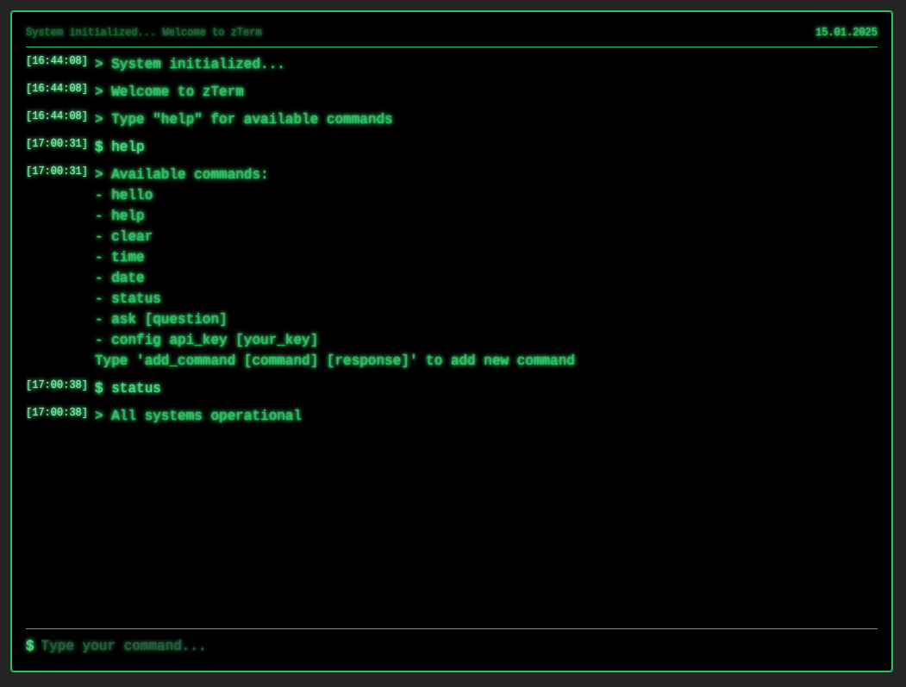

# Terminal AI

Komponent dla ReactJS, terminal w stylu starego monitora CRT, który umożliwia zadawanie pytań do AI.

### Instalacja

Projekt ReactJS utworzony za pomocą [Vite](https://vite.dev/guide/), korzysta z [Tailwind](https://tailwindcss.com/docs/guides/vite).

### interface aplikacji

